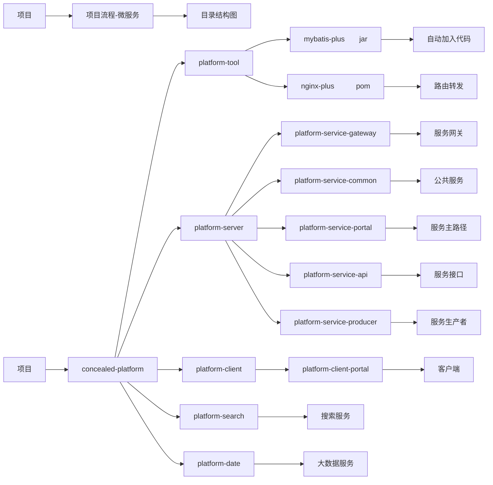
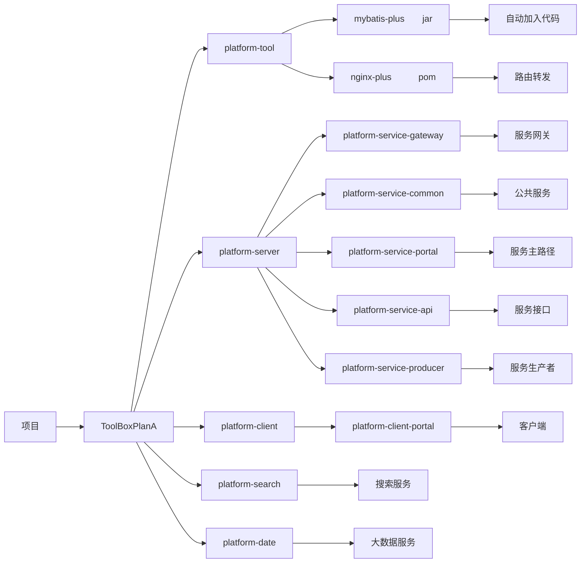

# Tool\_Box · Plan A 

Love you love  
　　　　　　　　　　　　　　　　　　　　　　　　　　　　　　　　　　　　　　　　　　　　　　　	---2020-10-14

## 名称定义

a,两个英文单词；b,简单易懂；c,直接明白内容；

工具箱。装工具的箱子，如：钳子、榔头等工具都为设计好的作品\软件。
该项目包含多个软件项目，取名为工具箱，意为软件即工具，服务于人。

## 项目结构图







## 项目启动进度

|  版本   |  修改日期  | 修改人 |     修改内容     |
| :-----: | :--------: | :----: | :--------------: |
| 0.0.0.1 | 2020-12-18 |  董松  |  新增README文件  |
| 0.0.0.1 | 2020-12-20 |  董松  | 新增初始工程文件 |
|         |            |        |                  |


## 备注

### git 使用命令
```java
如果有仓库，先拉下来远程仓库
git clone []
git init -d masterS      初始化本地仓库名为“masterS”
git remote add [originS] .git   //必须先关联远程仓库
git add .
git commit -m "3"
git pull originS master  拉去远程仓库的master分支
git push <远程主机名> <本地分支名>:<远程分支名>
git push originS master
git reflog -- relative-date //查看最近提交状态及其更新的时间
git reset --hard 801f6b4 (回退版本号)
git branch  
###
git init 
git remote add origin http://znsygit.hisensehics.com:447/scrm/hicrm-crm-wechat.git
git pull origin master
#重新写.ignore
写好ignore文件
git rm -r . --cached
git add .
  

   
```
